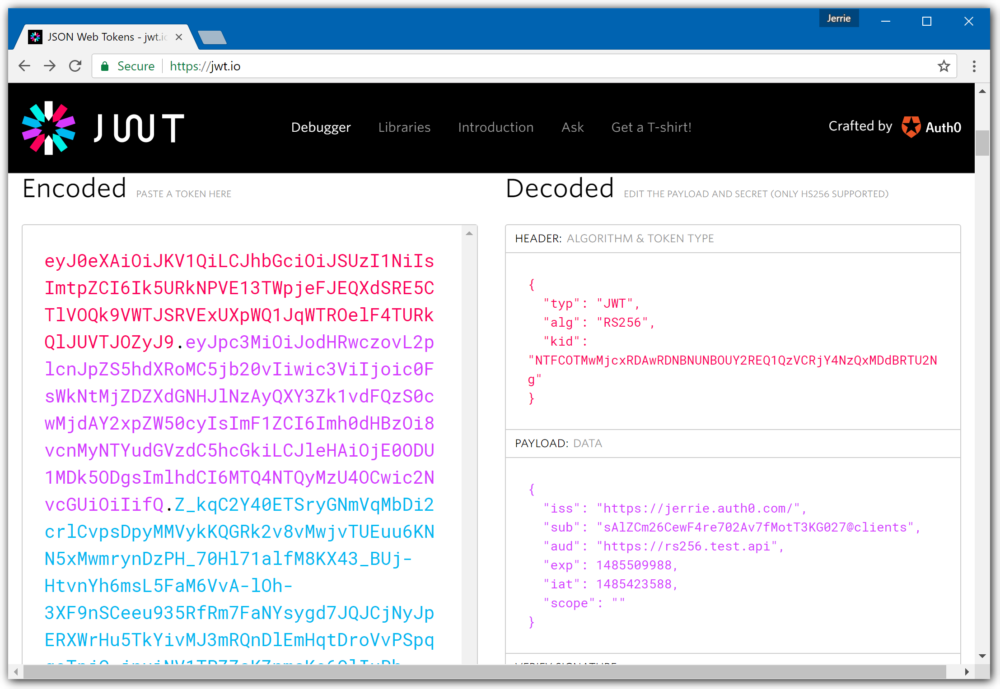
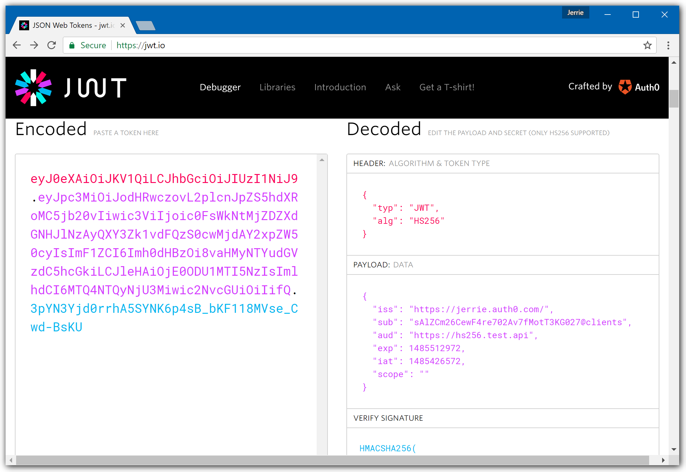

# Tutorial

This content has been extracted from a Quickstart that demonstrated securing an API using Spring 4 and the `auth0-spring-security-api` SDK.

See the [Spring Security 5 API Quickstart](https://auth0.com/docs/quickstart/backend/java-spring-security5) to learn how to use Auth0 to secure an API built using Spring Boot 2 and Spring Security 5.

> **New to Auth0?** Learn [how Auth0 works](https://auth0.com/docs/overview) and read about [implementing API authentication and authorization ](https://auth0.com/docs/api-auth) using the OAuth 2.0 framework.

## Configure Auth0 APIs

### Create an API

In the [APIs](https://manage.auth0.com/apis) section of the Auth0 dashboard, click **Create API**. Provide a name and an identifier for your API, for example, `https://quickstarts/api`. You will use the identifier as an `audience` later, when you are configuring the Access Token verification. Leave the **Signing Algorithm** as **RS256**.

By default, your API uses RS256 as the algorithm for signing tokens. Since RS256 uses a private/public keypair, it verifies the tokens against the public key for your Auth0 account. The public key is in the [JSON Web Key Set (JWKS)](https://auth0.com/docs/tokens/concepts/jwks) format, and can be accessed at `https://{YOUR-DOMAIN}/.well-known/jwks.json`.

### Define permissions

Permissions let you define how resources can be accessed on behalf of the user with a given access token. For example, you might choose to grant read access to the `messages` resource if users have the manager access level, and a write access to that resource if they have the administrator access level.

You can define allowed permissions in the Permissions tab of the Auth0 Dashboard's [APIs](https://manage.auth0.com/apis) section.

> This example uses the `read:messages` scope.

This example demonstrates:

- How to check for a JSON Web Token (JWT) in the `Authorization` header of an incoming HTTP request.
- How to check if the token is valid, using the [JSON Web Key Set (JWKS)](https://auth0.com/docs/tokens/concepts/jwks) for your Auth0 account. To learn more about validating Access Tokens, see [Validate Access Tokens](https://auth0.com/docs/tokens/guides/validate-access-tokens).

## Configure the Sample Project

The sample project has a `/src/main/resources/auth0.properties` file which configures it to use the correct Auth0 **Domain** and **API Identifier** for your API:

```yaml
auth0.issuer:https://{YOUR-DOMAIN}/
auth0.apiAudience:{YOUR-API-IDENTIFIER}
```

`auth0.issuer`: The issuer of the JWT Token. Typically, this is your Auth0 domain with an `https://` prefix and a `/` suffix. For example, if your Auth0 domain is `example.auth0.com`, the `auth0.issuer` must be set to `https://example.auth0.com/` (the trailing slash is important).
`auth0.apiAudience`: The unique identifier for your API. If you are following the steps in this tutorial it would be `https://quickstarts/api`.

## Validate Access Tokens

### Install dependencies

Add the `auth0-spring-security-api` dependency.

If you are using Maven, add the dependency to your `pom.xml` file:

```xml
<dependency>
  <groupId>com.auth0</groupId>
  <artifactId>auth0-spring-security-api</artifactId>
  <version>1.4.1</version>
</dependency>
```

If you are using Gradle, add the dependency to the dependencies block:

```groovy
implementation 'com.auth0:auth0-spring-security-api:1.4.1'
```

## Configure JSON Web Token signature algorithm

Configure your API to use the RS256 [signing algorithm](https://auth0.com/docs/tokens/concepts/signing-algorithms). 

```java
// src/main/java/com/auth0/example/AppConfig.java

@Configuration
@EnableWebSecurity
public class AppConfig extends WebSecurityConfigurerAdapter {

    @Value(value = "${auth0.apiAudience}")
    private String apiAudience;
    @Value(value = "${auth0.issuer}")
    private String issuer;

    @Override
    protected void configure(HttpSecurity http) throws Exception {
        JwtWebSecurityConfigurer
                .forRS256(apiAudience, issuer)
                .configure(http);
    }
}
```

## Protect API Endpoints

The routes shown below are available for the following requests:

- `GET /api/public`: available for non-authenticated requests
- `GET /api/private`: available for authenticated requests containing an Access Token with no additional scopes
- `GET /api/private-scoped`: available for authenticated requests containing an Access Token with the `read:messages` scope granted

The example below shows how to implement secure API methods. In the `AppConfig` class, add route matchers to the snippet. The `hasAuthority()` method provides a way to specify the required scope for the resource.

```java
// src/main/java/com/auth0/example/AppConfig.java

@Configuration
@EnableWebSecurity
public class AppConfig extends WebSecurityConfigurerAdapter {

    @Value(value = "${auth0.apiAudience}")
    private String apiAudience;
    @Value(value = "${auth0.issuer}")
    private String issuer;

    @Bean
    CorsConfigurationSource corsConfigurationSource() {
        CorsConfiguration configuration = new CorsConfiguration();
        configuration.setAllowedOrigins(Arrays.asList("http://localhost:3000"));
        configuration.setAllowedMethods(Arrays.asList("GET","POST"));
        configuration.setAllowCredentials(true);
        configuration.addAllowedHeader("Authorization");
        UrlBasedCorsConfigurationSource source = new UrlBasedCorsConfigurationSource();
        source.registerCorsConfiguration("/**", configuration);
        return source;
    }

    @Override
    protected void configure(HttpSecurity http) throws Exception {
        http.cors();
        JwtWebSecurityConfigurer
                .forRS256(apiAudience, issuer)
                .configure(http)
                .authorizeRequests()
                .antMatchers(HttpMethod.GET, "/api/public").permitAll()
                .antMatchers(HttpMethod.GET, "/api/private").authenticated()
                .antMatchers(HttpMethod.GET, "/api/private-scoped").hasAuthority("read:messages");
    }
}
```

### Create the API Controller

Create a new class called `APIController` to handle each request to the endpoints.

Next, in the `AppConfig.java` file, configure which endpoints are secure and which are not.

```java
// src/main/java/com/auth0/example/APIController.java

import org.springframework.stereotype.Component;
import org.springframework.stereotype.Controller;
import org.springframework.web.bind.annotation.RequestMapping;
import org.springframework.web.bind.annotation.RequestMethod;
import org.springframework.web.bind.annotation.ResponseBody;
import org.json.JSONObject;

@Controller
@Component
public class APIController {

    @RequestMapping(value = "/api/public", method = RequestMethod.GET, produces = "application/json")
    @ResponseBody
    public String publicEndpoint() {
        return new JSONObject()
                .put("message", "Hello from a public endpoint! You don\'t need to be authenticated to see this.")
                .toString();
    }

    @RequestMapping(value = "/api/private", method = RequestMethod.GET, produces = "application/json")
    @ResponseBody
    public String privateEndpoint() {
        return new JSONObject()
                .put("message", "Hello from a private endpoint! You need to be authenticated to see this.")
                .toString();
    }

    @RequestMapping(value = "/api/private-scoped", method = RequestMethod.GET, produces = "application/json")
    @ResponseBody
    public String privateScopedEndpoint() {
        return new JSONObject()
                .put("message", "Hello from a private endpoint! You need to be authenticated and have a scope of read:messages to see this.")
                .toString();
    }
}
```
## Run and Test Your API

To build and run the project, use the command:

```bash
./gradlew bootRun
```

or if you are on Windows:

```bash
gradlew.bat bootRun
```

Using a REST client such as Postman or cURL, issue a `GET` request to `http://localhost:3010/api/public`. You should receive the response:

```json
{"message":"All good. You DO NOT need to be authenticated to call /api/public."}
```

Next, issue a `GET` request to `http://localhost:3010/api/private`. You should receive a `401 Unauthorized` response:

```json
{"timestamp":1559321750022,"status":401,"error":"Unauthorized","message":"Unauthorized","path":"/api/private"}
```

To test that your API is properly secured, you can obtain a test token in the Auth0 Dashboard:

1. Go to the **Machine to Machine Applications** tab for the API you created above.
2. Ensure that your API test application is marked as authorized.
3. Click the **Test** tab, then **COPY TOKEN**.

Issue a `GET` request to the `/api/private` endpoint, this time passing the token you obtained above as an `Authorization` header set to `Bearer YOUR-API-TOKEN-HERE`. You should then see the response:

```json
{"message":"All good. You can see this because you are Authenticated."}
```

Finally, to test that our `/api/private-scoped` is properly protected by the `read:messages` scope, make a `GET` request to the `/api/private-scoped` endpoint using the same token as above. You should see a `403 Forbidden` response, as this token does not possess the `read:messages` scope:

```json
{"timestamp":1559322174584,"status":403,"error":"Forbidden","message":"Access is denied","path":"/api/private-scoped"}
```

Back in the Auth0 Dashboard:

1. Go to the **Permissions** tab for the API you created above.
2. Add a permission of `read:messages` and provide a description.
3. Go to the **Machine to Machine Applications** tab.
4. Expand your authorized test application, select the `read:messages` scope, then click **UPDATE** and then **CONTINUE**.
5. Click the **Test** tab, then **COPY TOKEN**.

Issue a GET request to `/api/private-scoped`, this time passing the token you obtained above (with the `read:messages` scope) as an `Authorization` header set to `Bearer YOUR-API-TOKEN-HERE`. You should see the response:

```json
{"message":"All good. You can see this because you are Authenticated with a Token granted the 'read:messages' scope"}
```

## Troubleshooting

If you configured JWT validation correctly, you will be able to get proper responses from your API when you make requests. However, in the case where you get a 401 (Unauthorized) response from your API, it is because the configuration of your JWT middleware does not match with the JWT which was passed.

This document will help you troubleshoot your JWT middleware configuration.

### How Does a Token Get Validated?

In terms of validating a JWT, there are various things to consider:

1. **Is the token well-formed?** In other words, is this token conforming to the structure of a JSON Web Token (JWT)? To get more information on the structure of a JWT, please refer to [this section on the structure of a JWT](https://auth0.com/docs/jwt#what-is-the-json-web-token-structure-)

2. **Has the token been tampered with?** The last part of a JWT is the signature. The signature is used to verify that the token was in fact signed by the sender and not altered in any way.

3. **Has the token been received in its validity period?** JWTs are only valid for a specified time period (as expressed in the `exp` claim).

4. **Is the token coming from the intended Authority?** This consists of 2 parts

    * **Signature Verification**: Can we confirm that the JWT is correctly signed using the key issued by the issuing authority?

    * **Issuer Value**: The Issuer is defined in the `iss` claim. Once again does this claim match up with what your application expects?

5. **Is the token intended for the current application?** So does the `aud` claim of the JWT match with what your application is expecting?

## Inspecting a Token

A quick way to inspect a JWT is by using the [JWT.io](https://jwt.io/) website. It has a handy debugger which allows you to quickly check that a JWT is well-formed, and also inspect the values of the various claims.



In the screenshot above you can see that the token was signed using the **RS256** algorithm. The **Issuer** of the token is **https://jerrie.auth0.com/**, and the **Audience** is **https://rs256.test.api**.

So, in other words, these values in your JWT validation configuration registration must match **exactly** - including the trailing slash for the Issuer, such as

```
audience = "https://rs256.test.api",
domain = "https://jerrie.auth0.com/"
};
```

For a token signed using HS256, the debugger view will look a little different:



In the screenshot above you can see that the token was signed using the **HS256** algorithm. The **Issuer** of the token is **https://jerrie.auth0.com/**, and the **Audience** is **https://hs256.test.api**.

