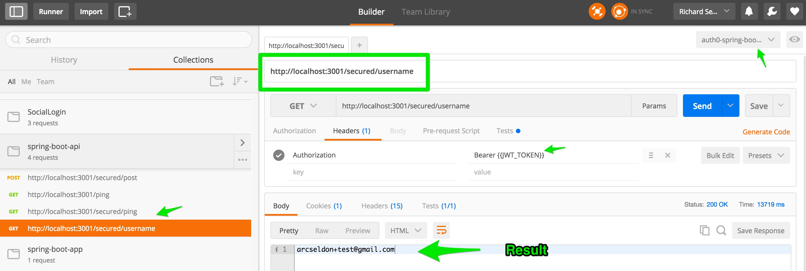

### Spring Boot / Auth0 JWT API

Demonstrates using Auth0 with Spring Boot and Spring Security to create a Java Spring API - JWT Token and Role level Authorization

This sample would be suitable for headless APIs and SPA (single page application) backend end server scenarios.

This sample application shows you how to:

 1. Configure and run Java based Spring API server with Auth0 and Spring Security
 2. 100% Java Configuration (Annotations)
 3. Secure one or more URL endpoints with Role / Authority based permissions (ROLE_USER, ROLE_ADMIN etc)
 4. Secure Java Services using method level security annotations for role based access control

Let's get started - it only takes a few minutes to have a working application with all the above.

This example relies upon `Spring Boot`.

Benefits of Spring Boot, in particular for traditional server-side web application / microservices architectures:

**Automatic configuration** - Spring Boot can automatically provide configuration for application functionality common to many Spring applications.

**Starter dependencies** - Tell Spring Boot what kind of functionality you need, and it will ensure that the libraries needed are added to the build.

**Command-line interface** - Optional feature of Spring Boot lets you write complete applications with just application code, but no need for a traditional
 project build.

**The Actuator** - Gives you insight into what's going on inside of a running Spring Boot application.

Useful quick start reference to getting started with [Spring Boot](https://docs.spring.io/spring-boot/docs/current/reference/html/getting-started-first-application.html)

### Prerequisites

In order to run this example you will need to have Maven installed. You can install Maven with [brew](http://brew.sh/):

```sh
brew install maven
```

Check that your maven version is 3.0.x or above:

```sh
mvn -v
```

### Setup

Create an [Auth0 Account](https://auth0.com) (if not already done so - free!).


#### From the Auth0 Dashboard

Create an application - for the purposes of this sample - `app`

Add one or more `connections` to your application - for instance Google Social Connection,
or username-password DB connection.


###### Add Role Based Authorization By Creating an Auth0 Rule


Since this sample applies Role based authorization on the Home Page (defaults to requiring `ROLE_ADMIN`), go to `Rules`
and create the following new Rule:

```
function (user, context, callback) {
  user.app_metadata = user.app_metadata || {};
  // You can add a Role based on what you want
  var addRolesToUser = function(user, cb) {
      cb(null, ['ROLE_ADMIN']);
  };

  addRolesToUser(user, function(err, roles) {
    if (err) {
      callback(err);
    } else {
      user.app_metadata.roles = roles;
      auth0.users.updateAppMetadata(user.user_id, user.app_metadata)
        .then(function(){
          callback(null, user, context);
        })
        .catch(function(err){
          callback(err);
        });
    }
  });
}
```

In our simple Rule above, we add `ROLE_ADMIN` to any user profiles.
Our Spring Security Sample app will read this information from the JWT Token and apply
the granted authorities when checking authorization access to secured endpoints configured with Role based permissions

Here is our sample `AppConfig` entry where we specify the endpoints security settings.


```
   // Apply the Authentication and Authorization Strategies your application endpoints require
     http.authorizeRequests()
             .antMatchers("/secured/post").hasAnyAuthority("ROLE_USER", "ROLE_ADMIN")
             .antMatchers("/secured/username").hasAnyAuthority("ROLE_USER", "ROLE_ADMIN")
             .antMatchers(securedRoute).authenticated();
```


Here, we only allow users with `ROLE_USER` or `ROLE_ADMIN` to access `/secured/post`
and `/secured/username` endpoints.


### Inside the Application - update configuration information

Enter your:

`client_id`, `client_secret`, and `domain` information into `src/main/resources/auth0.properties`

Note: There is a property in `auth0.properties` that you do not need to touch. Leave the value as `false`

`auth0.defaultAuth0ApiSecurityEnabled: false` - this ensures we do not autowire the default configuration file
provided with the `auth0-spring-security-api` library itself. That is a default configuration suitable only for
simpler applications with a single secured URL endpoint and acts as a template for actual apps to base their
config from - also used for autowiring dependencies for tests in the library.


### Build and Run

In order to build and run the project execute:

```sh
mvn spring-boot:run
```

### Test the API

To run a request against the exposed API endpoints, simply make GET or POST requests as follows (using any http client you choose):


#### Public endpoint:

```
curl -X GET -H "Content-Type: application/json" -H "Cache-Control: no-cache" "http://localhost:3001/ping"
```

#### Secured endpoints:

```
curl -X GET -H "Authorization: Bearer {{YOUR JWT TOKEN}}" -H "Content-Type: application/json" -H "Cache-Control: no-cache" "http://localhost:3001/secured/ping"
```

or

```
curl -X GET -H "Authorization: Bearer {{YOUR JWT TOKEN}}" -H "Content-Type: application/json" -H "Cache-Control: no-cache" "http://localhost:3001/secured/username"
```

or

```
curl -X POST -H "Authorization: Bearer {{YOUR JWT TOKEN}}" -H "Content-Type: application/json" -H "Cache-Control: no-cache" -d '{"hello":"world"}' "http://localhost:3001/secured/post"
```

There is also a [postman](https://www.getpostman.com) collection (postman/auth0-spring-boot-api-example.postman_collection.json) published in case
you use postman for your API testing. Again, replace {{JWT_TOKEN}} with your token (or use Postman's `manage environments` feature to map JWT_TOKEN key
to your jwt token string).

Key Point: Remember to include the `Authorization: Bearer {{YOUR JWT TOKEN}}"` header. You can generate a JWT perhaps easiest by downloading
a web client sample from the Auth0 Dashboard for the same application you defined above, and then by logging using that App and retrieving the
generated JWT token that way.

---

### Screenshot of Postman making API calls:


#### Postman Example



---


## What is Auth0?

Auth0 helps you to:

* Add authentication with [multiple authentication sources](https://docs.auth0.com/identityproviders), either social like **Google, Facebook, Microsoft Account, LinkedIn, GitHub, Twitter, Box, Salesforce, amont others**, or enterprise identity systems like **Windows Azure AD, Google Apps, Active Directory, ADFS or any SAML Identity Provider**.
* Add authentication through more traditional **[username/password databases](https://docs.auth0.com/mysql-connection-tutorial)**.
* Add support for **[linking different user accounts](https://docs.auth0.com/link-accounts)** with the same user.
* Support for generating signed [Json Web Tokens](https://docs.auth0.com/jwt) to call your APIs and **flow the user identity** securely.
* Analytics of how, when and where users are logging in.
* Pull data from other sources and add it to the user profile, through [JavaScript rules](https://docs.auth0.com/rules).

## Create a free account in Auth0

1. Go to [Auth0](https://auth0.com) and click Sign Up.
2. Use Google, GitHub or Microsoft Account to login.

## Issue Reporting

If you have found a bug or if you have a feature request, please report them at this repository issues section. Please do not report security vulnerabilities on the public GitHub issue tracker. The [Responsible Disclosure Program](https://auth0.com/whitehat) details the procedure for disclosing security issues.

## Author

[Auth0](auth0.com)

## License

This project is licensed under the MIT license. See the [LICENSE](LICENSE.txt) file for more info.


