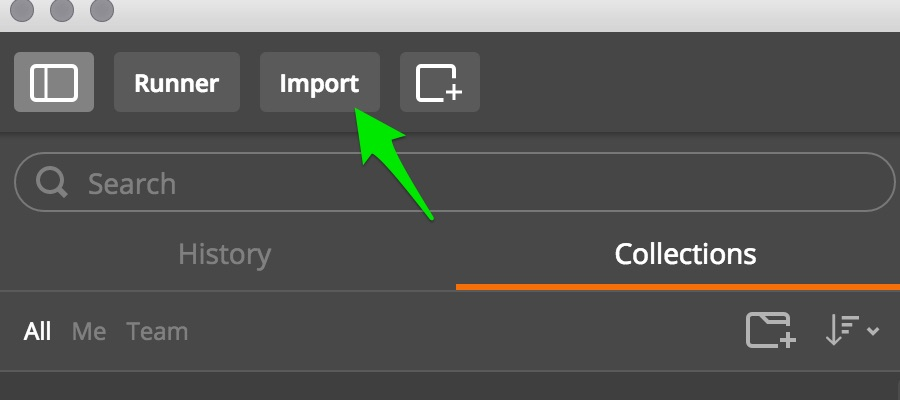
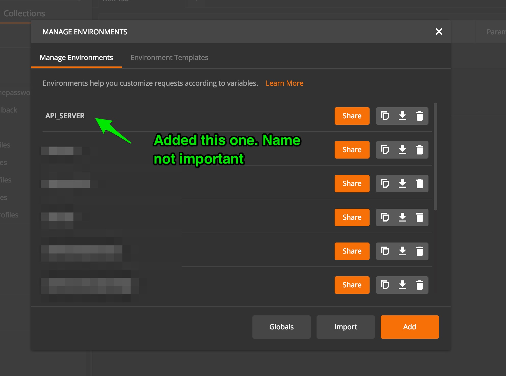
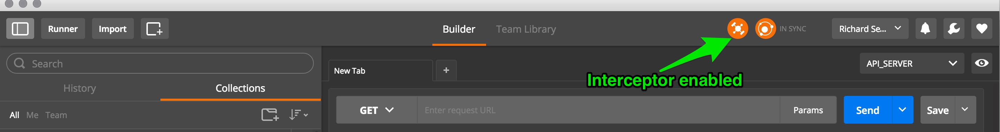
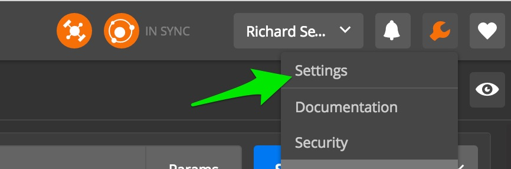
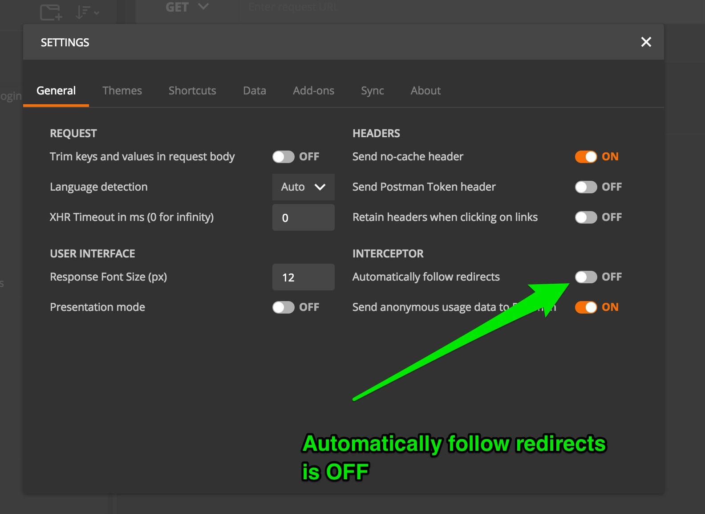
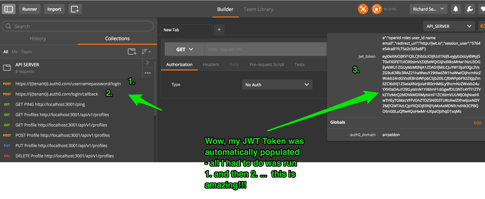
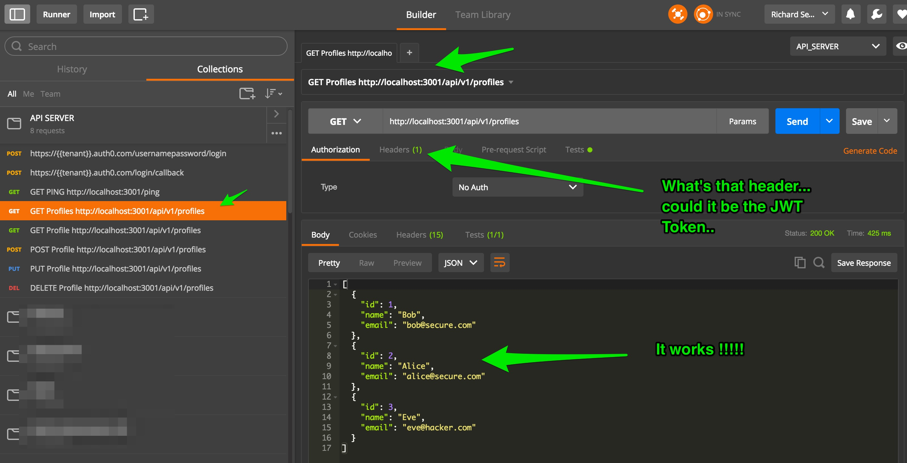
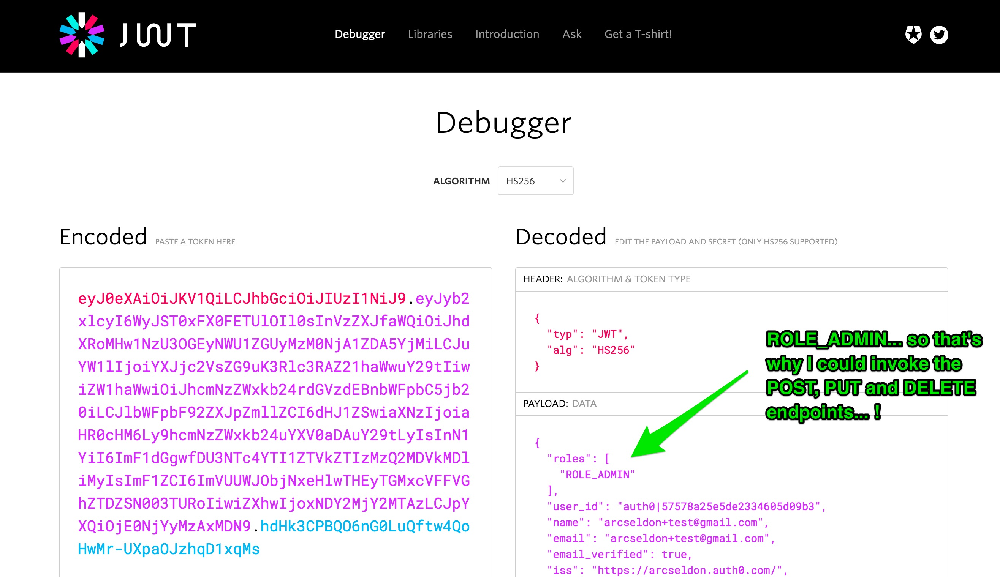

### Auth0 API Sample - using Spring Boot and Spring Security

This is a companion sample for the [Auth0 Spring Security API](https://github.com/auth0/auth0-spring-security-api) library.
Please refer to that library and documentation for further information specific to the library itself.

Demonstrates using Auth0 with Spring Boot and Spring Security to create a Java Spring API - JWT Token and Role level Authorization

This sample would be suitable for headless APIs and SPA (single page application) backend end server scenarios.

This sample application shows you how to:

 1. Configure and run Java based Spring API server with Auth0 and Spring Security
 2. 100% Java Configuration (Annotations)
 3. Secure one or more URL endpoints with Role / Authority based permissions (ROLE_USER, ROLE_ADMIN etc)
 4. Secure Java Services using method level security annotations for role based access control
 5. It also shows you how to setup a REST CRUD Controller using Spring Boot!
    Here we shall perform GET, POST, PUT, and DELETE operations on a Profile domain object

Let's get started - it only takes a few minutes to have a working application with all the above.

This example relies upon `Spring Boot`.

Benefits of Spring Boot, in particular for traditional server-side web application / microservices architectures:

**Automatic configuration** - Spring Boot can automatically provide configuration for application functionality common to many Spring applications.

**Starter dependencies** - Tell Spring Boot what kind of functionality you need, and it will ensure that the libraries needed are added to the build.

**Command-line interface** - Optional feature of Spring Boot lets you write complete applications with just application code, but no need for a traditional
 project build.

**The Actuator** - Gives you insight into what's going on inside of a running Spring Boot application.

Useful quick start reference to getting started with [Spring Boot](https://docs.spring.io/spring-boot/docs/current/reference/html/getting-started-first-application.html)

### Prerequisites

In order to run this example you will need to have Maven installed. You can install Maven with [brew](http://brew.sh/):

```sh
brew install maven
```

Check that your maven version is 3.0.x or above:

```sh
mvn -v
```

### Setup

Create an [Auth0 Account](https://auth0.com) (if not already done so - free!).


#### From the Auth0 Dashboard

Create an application - for the purposes of this sample - `app`

Add one or more `connections` to your application - for instance Google Social Connection,
or username-password DB connection.


###### Add Role Based Authorization By Creating an Auth0 Rule


Since this sample applies Role based authorization on the Home Page (defaults to requiring `ROLE_ADMIN`), go to `Rules`
and create the following new Rule:

```
function (user, context, callback) {

  // ignore this rule if not correct client id of application using Rules
   if (context.clientID !== '{{YOUR CLIENT ID}}') {
     return callback(null, user, context);
   }

  user.app_metadata = user.app_metadata || {};
  // You can add a Role based on what you want
  var addRolesToUser = function(user, cb) {
      cb(null, ['ROLE_ADMIN', 'ROLE_USER']);
  };

  addRolesToUser(user, function(err, roles) {
    if (err) {
      callback(err);
    } else {
      user.app_metadata.roles = roles;
      auth0.users.updateAppMetadata(user.user_id, user.app_metadata)
        .then(function(){
          callback(null, user, context);
        })
        .catch(function(err){
          callback(err);
        });
    }
  });
}
```

In our simple Rule above, we add `ROLE_ADMIN` and `ROLE_USER` to any user profiles.
We also only wish to apply this Rule to the Application we are currently using.
You should replace `{{YOUR CLIENT ID}}` with the `client_id` of your application - the rule will
then be ignored by any other applications you may have defined.

Our Spring Security Sample app will read this information from the JWT Token and apply
the granted authorities when checking authorization access to secured endpoints configured with Role based permissions

Here is our sample `AppConfig` entry where we specify the endpoints security settings.


```
  @Override
      protected void authorizeRequests(final HttpSecurity http) throws Exception {
          http.authorizeRequests()
                  .antMatchers("/ping").permitAll()
                  .antMatchers(HttpMethod.GET, "/api/v1/profiles").hasAnyAuthority("ROLE_USER", "ROLE_ADMIN")
                  .antMatchers(HttpMethod.GET, "/api/v1/profiles/**").hasAnyAuthority("ROLE_USER", "ROLE_ADMIN")
                  .antMatchers(HttpMethod.POST, "/api/v1/profiles/**").hasAnyAuthority("ROLE_ADMIN")
                  .antMatchers(HttpMethod.PUT, "/api/v1/profiles/**").hasAnyAuthority("ROLE_ADMIN")
                  .antMatchers(HttpMethod.DELETE, "/api/v1/profiles/**").hasAnyAuthority("ROLE_ADMIN")
                  .antMatchers(securedRoute).authenticated();
      }
```


Here we are permitting anyone to call our `ping` endpoint (no JWT required).

We are allowing both `ROLE_USER` and `ROLE_ADMIN` to access GET (read) `profiles` endpoints

We are restricting POST, PUT and DELETE operations to strictly `ROLE_ADMIN` level role access.


### Inside the Application - update configuration information

Enter your:

`client_id`, `client_secret`, and `domain` information into `src/main/resources/auth0.properties`

Note: There is a property in `auth0.properties` that you do not need to touch. Leave the value as `false`

`auth0.defaultAuth0ApiSecurityEnabled: false` - this ensures we do not autowire the default configuration file
provided with the `auth0-spring-security-api` library itself. That is a default configuration suitable only for
simpler applications with a single secured URL endpoint and acts as a template for actual apps to base their
config from - also used for autowiring dependencies for tests in the library.

For details on the other settings, please check the README for the library this sample depends on  [Auth0 Spring Security API](https://github.com/auth0/auth0-spring-security-api).
In particular, [this section on defalut configuration](https://github.com/auth0/auth0-spring-security-api#default-configuration) which lists each property together with a
description on its purpose.


### Build and Run

In order to build and run the project execute:

```sh
mvn spring-boot:run
```

### Test the API

To run a request against the exposed API endpoints, simply make GET or POST requests as follows (using any http client you choose):

Key Point: Remember to include the `Authorization: Bearer {{YOUR JWT TOKEN}}"` header. You can generate a JWT perhaps easiest by downloading
a web client sample from the Auth0 Dashboard for the same application you defined above, and then by logging using that App and retrieving the
generated JWT token that way.

Make sure that the `scope` includes the following as a bare minimum:  `openid roles`  - without `roles` your JWT will contain no roles information
regardless of what is associated with the UserProfile itself.

Here is a snippet of code for Lock, roughly how this should look:

```
var lock = new Auth0Lock('${clientId}', '${domain}');
lock.showSignin({
    authParams: {
        scope: 'openid roles user_id name email'
    },
    // ... other params
});
```

If this is still sounding like a lot of work, read the next section on Postman - this is nearly completely automated for you...

### Use Pre-configured Postman Collection (OPTIONAL STEP)

Postman is an incredibly helpful tool for testing HTTP / REST apis.  With this sample, there is also a [postman](https://www.getpostman.com) collection
`postman/api-server.postman_collection.json` published in case you use postman for your API testing.

Included is a means for you to generate your own `jwt_token` directly from Postman. However, there is a tiny amount of setup involved.

Screenshots provided below that explain what to do:

##### Import the Postman Collection





##### Manage Environment


##### Create New Env




##### Complete variables information


Here, we are supposing you have defined an application in Auth0 dashboard associated
with a DB Connection, and a registered user with a `username` and `password`

Notice `scope` includes `roles` in its values...

##### Configure the Interceptor in Postman to switch OFF automatic redirects

We want to set this up so that when the REDIRECT occurs after authentication but
before any Callback is redirected to, we can pull the `id_token` value out of the
`Location` response header. To achieve this we must ensure that POSTMAN automatic
redirects are disabled. To do this, you must have the Postman Interceptor installed
(- I was using Chrome web browser when doing this)

The Interceptor is simply another developer tool. Once installed, just follow the screenshots
below and we are ready to go.

######  Once installed, enable interceptor as below




######  Go to Postman settings..





######  Turn off automatic redirects




##### Run Postman

Ok, time to finally put all that preparation work to good use.

At this point, execute the `/usernamepassword/login` command, followed by `/login/callback`

You now have a brand new JWT Token that will be automatically supplied with each call.



And finally, run one of the endpoints:




Congratulations, you're awesome. :)


##### Bonus - view JWT Token using https://jwt.io

Go to jwt.io website, and paste your generated JWT Token in the Encoded box.

You should get some good ideas on how it looks:




### Prefer the Command Line

If you'd rather avoid Postman, and obtain your JWT token another way (perhaps downloading
an alternate seed project for the same application and running that, or else generating your own
with a JWT SDK library etc), then no probs.

Here are some examples of the available endpoints using CURL from the command line instead.
For the secured endpoints, please ensure you replace {{jwt_token}} with your JWT Token value.


#### Public endpoint:

```
curl -X GET -H "Content-Type: application/json" -H "Cache-Control: no-cache" "http://localhost:3001/ping"
```

#### Secured endpoints:

```
curl -X GET -H "Authorization: Bearer {{jwt_token}}" -H "Cache-Control: no-cache" "http://localhost:3001/api/v1/profiles"
```

or

```
curl -X GET -H "Authorization: Bearer {{jwt_token}}" -H "Cache-Control: no-cache" "http://localhost:3001/api/v1/profiles/1"
```

or

```
curl -X POST -H "Authorization: Bearer {{jwt_token}}" -H "Content-Type: application/json" -H "Cache-Control: no-cache" -d '{
    "name": "Chuck",
    "email": "chuck@communications.com"
 }' "http://localhost:3001/api/v1/profiles"
```

or

```
curl -X PUT -H "Authorization: Bearer {{jwt_token}}" -H "Content-Type: application/json" -H "Cache-Control: no-cache" -d '{
    "email": "bob@youwerehacked.com"
 }' "http://localhost:3001/api/v1/profiles/1"
```

or

```
curl -X DELETE -H "Authorization: Bearer {{jwt_token}}" -H "Cache-Control: no-cache" "http://localhost:3001/api/v1/profiles/2"
```


---


## What is Auth0?

Auth0 helps you to:

* Add authentication with [multiple authentication sources](https://docs.auth0.com/identityproviders), either social like **Google, Facebook, Microsoft Account, LinkedIn, GitHub, Twitter, Box, Salesforce, amont others**, or enterprise identity systems like **Windows Azure AD, Google Apps, Active Directory, ADFS or any SAML Identity Provider**.
* Add authentication through more traditional **[username/password databases](https://docs.auth0.com/mysql-connection-tutorial)**.
* Add support for **[linking different user accounts](https://docs.auth0.com/link-accounts)** with the same user.
* Support for generating signed [Json Web Tokens](https://docs.auth0.com/jwt) to call your APIs and **flow the user identity** securely.
* Analytics of how, when and where users are logging in.
* Pull data from other sources and add it to the user profile, through [JavaScript rules](https://docs.auth0.com/rules).

## Create a free account in Auth0

1. Go to [Auth0](https://auth0.com) and click Sign Up.
2. Use Google, GitHub or Microsoft Account to login.

## Issue Reporting

If you have found a bug or if you have a feature request, please report them at this repository issues section. Please do not report security vulnerabilities on the public GitHub issue tracker. The [Responsible Disclosure Program](https://auth0.com/whitehat) details the procedure for disclosing security issues.

## Author

[Auth0](auth0.com)

## License

This project is licensed under the MIT license. See the [LICENSE](LICENSE.txt) file for more info.


